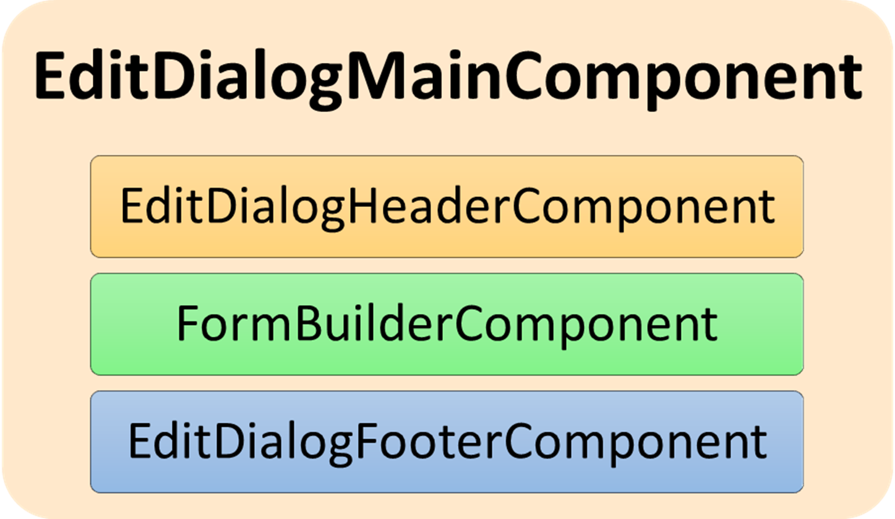

# Edit-UI

## Routes in `EditRoutingModule`

- EditModule
- RefreshEditModule
- ItemHistoryModule

`DialogEntryComponent` is entry component. It will open dialog with screen based on route.

## EditEntryComponent

Purpose:

1. component will first prepare data for edit form using `EditInitializerService`
1. than will show `EditDialogMainComponent`

## EditDialogMainComponent

Purpose:

- build form and form controls for Edit-UI in dialog
- edit and validate form data
- save form data

Components:

- EditDialogHeaderComponent
- FormBuilderComponent
- EditDialogFooterComponent

### EditDialogHeaderComponent

Purpose:

1. close dialog
1. change publishing state

### FormBuilderComponent

Build dynamic, reactive form to edit entity data.

Purpose:

1. prepare field settings using `FieldsSettingsService`
1. prepare field translations using `FieldsTranslateService`
1. build and add form controls using `FormBuilder`
1. handle form values (default, initial, changed)
1. enable/disable controls
1. handle form validation

Components:

- EntityWrapperComponent

#### EntityWrapperComponent

Purpose:

1. groups
1. read-only
1. languages
1. tooltips
1. headers
1. settings
1. saved state
1. metadata
1. template vars
1. notes
1. history
1. refresh

Components:

- EntityTranslateMenuComponent
- [`FieldsBuilderDirective`](form-builder.md) in `ng-container`

### EditDialogFooterComponent

Enable **Debug mode** to see this control with: [Shit]+[Ctrl]+[Alt]+(Mouse Click).

Purpose:

- Data
- Formulas
- Logs
